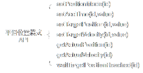
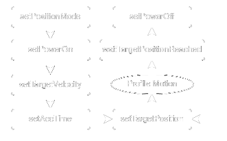
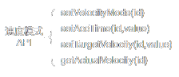
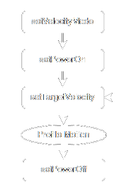
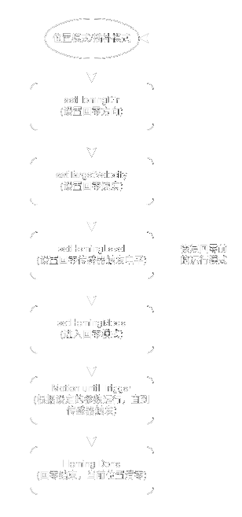

# DBD-Bee2 步进电机驱动器

<div align="center">
  
  
  ⭐ **高性能闭环步进电机驱动解决方案**
  
  [](downloads/Bee2-SDK.zip)
  [](downloads/Bee2通信协议.xlsx)
  [](#)
  
</div>

---

## 🚀 产品亮点

- 🔥 **大功率低发热** - 独立MOS驱动设计
- 🛡️ **隔离通信** - 提供更好的抗干扰能力
- 📡 **丰富接口** - 支持IO输入/输出、限位传感器
- 🎯 **高精度控制** - FOC控制，不丢步，高转速
- 🔧 **便捷维护** - 大号接插件，施工接线更方便
- 📏 **紧凑设计** - 50×60×9mm，性能提升远超尺寸增长

## 📋 目录

- [📖 产品简介](#-产品简介)
- [⚡ 技术规格](#-技术规格)
  - [📊 技术参数](#技术参数)
  - [🔌 硬件接口](#硬件接口)
- [🎨 产品展示](#-产品展示)
  - [👀 外观设计](#外观设计)
  - [📐 机械尺寸](#机械尺寸)
  - [🔗 接口布局](#接口布局)
- [🛠️ 使用指南](#️-使用指南)
  - [💻 调试软件](#调试软件)
  - [⚙️ 运行模式](#运行模式)
- [👨‍💻 开发者资源](#-开发者资源)
  - [🐍 Python SDK](#python-sdk)
  - [📡 通信协议](#通信协议)
- [🎥 相关视频](#-相关视频)
- [🏢 关于我们](#-关于我们)

---

## 📖 产品简介

<div align="center">
  
</div>

Bee2是DBD团队精心研发的新一代小型步进电机驱动器，专为高精度运动控制应用而设计。

### ✨ 核心特性

| 特性 | 描述 |
|------|------|
| 🔋 **高效驱动** | 大功率低发热独立MOS驱动技术 |
| 🛡️ **安全隔离** | 隔离通信设计，抗干扰能力强 |
| 🔌 **丰富接口** | IO输入/输出、正负限位传感器接口 |
| 🎯 **精准控制** | 增量式差分编码器 + FOC控制 |
| 🔧 **便捷维护** | 大号接插件设计，施工维修更方便 |
| 📏 **优化尺寸** | 50×60×9mm，性能密度大幅提升 |

## ⚡ 技术规格

### 📊 技术参数

<div align="center">

| 参数 | 规格 | 备注 |
|------|------|------|
| **基本参数** | | |
| 重量 | 32g | 轻量化设计 |
| 尺寸 | 50×60×9mm | 紧凑型封装 |
| 工作电压 | DC 12V/24V | 宽电压范围 |
| 运行温度 | -10°C ~ +60°C | 工业级温度范围 |
| **电机控制** | | |
| 电机类型 | 4线2相闭环步进电机 | 高精度控制 |
| 细分精度 | 256 | 超高细分 |
| 最大电流 | 3A | 大功率输出 |
| PWM频率 | 20KHz | 低噪音运行 |
| **编码器** | | |
| 编码器类型 | 差分ABZ增量编码器 | 抗干扰能力强 |
| 编码器分辨率 | 1000线 | 4倍频=4000脉冲/圈 |
| **通信接口** | | |
| 通信协议 | RS485 | 工业标准 |
| 通信速率 | 250Kbps/500Kbps | 高速通信 |
| **IO接口** | | |
| 输入IO | 1路 | 内部10KΩ上拉 |
| 输出IO | 1路 | 开漏输出500mA |
| 限位IO | 2路 | 内部10KΩ上拉 |

</div>

### 🔌 硬件接口

<div align="center">

| 接口类型 | 连接器规格 | 数量 | 功能说明 |
|----------|------------|------|----------|
| ⚡ **电源** | XH2.54-2P | 2个 | 可并联增加电流或串联减少接线 |
| 📡 **通信** | XH2.54-4P | 2个 | RS485通信，支持菊花链连接 |
| 🔧 **电机** | XH2.54-4P | 1个 | 4线2相步进电机连接 |
| 🛑 **限位** | PHB2.0-3×2P | 1个 | 正负限位传感器接口 |
| 🔌 **IO** | PHB2.0-3×2P | 1个 | 数字输入/输出接口 |
| 📊 **编码器** | PB2.0-4×2P | 1个 | 差分编码器信号接口 |

</div>

> 💡 **设计亮点**：采用大号接插件设计，确保连接可靠性的同时便于现场施工和维护。

---

## 🎨 产品展示

### 👀 外观设计

<div align="center">
  <table>
    <tr>
      <td></td>
      <td></td>
      <td></td>
      <td></td>
    </tr>
    <tr>
      <td align="center"><strong>电机侧</strong></td>
      <td align="center"><strong>左侧</strong></td>
      <td align="center"><strong>电源侧</strong></td>
      <td align="center"><strong>右侧</strong></td>
    </tr>
  </table>
</div>

<div align="center">
  <table>
    <tr>
      <td></td>
      <td></td>
      <td></td>
      <td></td>
    </tr>
  </table>
</div>

### 📐 机械尺寸

<div align="center">
  <table>
    <tr>
      <td align="center">
        <h4>📦 裸板尺寸</h4>
        
        <p><strong>50mm × 60mm × 9mm</strong></p>
      </td>
      <td align="center">
        <h4>🏠 带外壳尺寸</h4>
        
        <p><strong>完整封装尺寸</strong></p>
      </td>
    </tr>
  </table>
</div>

<div align="center">
  <h4>🎯 3D模型下载</h4>
  <a href="https://share.feijipan.com/s/uT0nTbyE">
    
  </a>
</div>

### 🔗 接口布局

<div align="center">
  <table>
    <tr>
      <td align="center">
        <h4>🔌 接口分布图</h4>
        
      </td>
      <td align="center">
        <h4>📍 引脚定义</h4>
        
      </td>
    </tr>
  </table>
</div>

---

## 🛠️ 使用指南

### 🔌 IO接口与传感器连接

#### 📋 接口说明

传感器接口采用 **PHB2.0-3×2P** 接插件设计：

<div align="center">

| 位置 | 信号 | 功能 | 说明 |
|------|------|------|------|
| **上排** | GND | 地线 | 公共地 |
| **上排** | OUTPUT | 输出信号 | 控制继电器、电磁刹车等 |
| **上排** | 24V | 电源正极 | 跟随输入电压(12V/24V) |
| **下排** | GND | 地线 | 公共地 |
| **下排** | INPUT | 输入信号 | 内部10KΩ上拉电阻 |
| **下排** | 24V | 电源正极 | 跟随输入电压(12V/24V) |

</div>

> ⚠️ **注意**：24V标识会根据实际供电电压变化，使用12V供电时实际输出12V。

#### 🔧 常用传感器接线方法

<div align="center">
  <table>
    <tr>
      <td align="center">
        <h5>🔘 两脚触碰开关</h5>
        
        
        <p><small>简单可靠的机械开关</small></p>
      </td>
      <td align="center">
        <h5>🔘 三脚触碰开关</h5>
        
        
        <p><small>带公共端的机械开关</small></p>
      </td>
    </tr>
    <tr>
      <td align="center">
        <h5>💡 光电传感器</h5>
        
        
        <p><small>非接触式检测</small></p>
      </td>
      <td align="center">
        <h5>🧲 霍尔传感器</h5>
        
        
        <p><small>磁场感应检测</small></p>
      </td>
    </tr>
  </table>
</div>

> 📝 **接线提示**：
> - NPN型传感器：信号线接INPUT，电源正极接24V，负极接GND
> - PNP型传感器：需要外接下拉电阻或使用NPN输出模式
> - 机械开关：直接串联在INPUT和GND之间

### 💻 调试软件

#### 🖥️ DBD Tuner V6 调试软件

<div align="center">
  <a href="downloads/DBD-Tuner.zip">
    
  </a>
  <br>
  <a href="downloads/DBD-Tuner.zip">
    
  </a>
</div>

#### 🔌 USB串口驱动下载

<div align="center">
  <table>
    <tr>
      <td align="center">
        <h5>🪟 Windows 驱动</h5>
        <a href="downloads/CH341SER.EXE">
          
        </a>
      </td>
      <td align="center">
        <h5>🐧 Linux 驱动</h5>
        <a href="downloads/CH341SER_LINUX.ZIP">
          
        </a>
      </td>
      <td align="center">
        <h5>🍎 macOS 驱动</h5>
        <a href="downloads/CH341SER_MAC.ZIP">
          
        </a>
      </td>
    </tr>
  </table>
</div>

#### 🎛️ 软件功能特性

- 🔍 **设备扫描** - 自动识别在线设备
- ⚙️ **参数配置** - 可视化参数设置界面
- 📊 **实时监控** - 位置、速度、电流实时显示
- 🎯 **运动控制** - 支持多种运行模式
- 💾 **参数保存** - 一键保存设备参数
- 🔧 **调试工具** - 丰富的调试和测试功能

> 📸 **软件截图和详细功能介绍即将更新...**

### ⚙️ 运行模式

Bee2支持多种运行模式，满足不同应用场景的需求：

<div align="center">

#### 🎯 位置模式 (Position Mode)
**平滑位置模式 - 精确点位运动**

根据设定的目标位置、目标速度和加速时间，自动规划位置-时间曲线并执行运动。适用于需要精确定位的应用场景。




---

#### 🏃 速度模式 (Velocity Mode)
**平滑速度模式 - 连续运动控制**

根据设定的目标速度和加速时间，自动规划速度-时间曲线。控制对象是电机运行速度，不关心具体位置。




---

#### 🏠 回零模式 (Homing Mode)
**智能回零 - 建立坐标系统**



**有感回零**：使用限位传感器
- 根据设定方向和速度运动至传感器触发
- 支持正负限位传感器，方向对应有效
- 触发后自动恢复原运行模式

**无感回零**：基于编码器和电流检测
- 通过检测电机堵转判断机械零点
- 无需外部传感器，降低系统复杂度

---

#### 🔄 插补模式 (Interpolation Mode)
**同步位置插补 - 多轴联动**

实现多轴电机的同步插补运动，支持连续轨迹控制：
- **8轴同步**：USB485标准配置
- **32轴/256轴**：专用控制器（需联系客服）

**应用场景**：3D打印机、写字机、画图机、雕刻机、点胶机等

---

#### 🛑 急停模式 (Emergency Stop)
**紧急停止 - 安全保护**

在任意运行模式下都可切换到急停模式：
- 按预设减速系数平滑减速至停止
- 停止后自动恢复为位置模式

**触发方式**：
1. 软件指令触发（参数索引0x03，值0x3d）
2. 限位传感器触发（需使能传感器限位功能）

</div>

## 👨‍💻 开发者资源

<div align="center">
  <h3>🚀 快速开始开发</h3>
  <p>提供完整的SDK和详细的通信协议文档，助您快速集成Bee2到您的项目中</p>
</div>

### 📦 SDK下载

<div align="center">
  <table>
    <tr>
      <td align="center">
        <h4>🐍 Python SDK</h4>
        <a href="downloads/Bee2-SDK.zip">
          
        </a>
        <p><small>完整的Python开发包</small></p>
      </td>
      <td align="center">
        <h4>📋 通信协议</h4>
        <a href="downloads/Bee2通信协议.xlsx">
          
        </a>
        <p><small>详细的RS485协议文档</small></p>
      </td>
    </tr>
  </table>
</div>

### 🐍 Python SDK

#### 📚 API接口分类

SDK接口按功能分为4大类，提供完整的电机控制能力：

<details>
<summary><strong>⚙️ 参数设置类 (Set Functions)</strong></summary>

| 函数名 | 参数 | 功能描述 |
|--------|------|----------|
| `setPowerOn(id)` | id: 设备ID | 使能电机控制，状态灯变为慢闪 |
| `setPowerOff(id)` | id: 设备ID | 失能电机控制，状态灯变为快闪 |
| `setTargetVelocity(id, value)` | value: 1-300 pulse/ms | 设置目标速度 |
| `setTargetPosition(id, value)` | value: 脉冲数 | 设置目标位置(51200脉冲=1圈) |
| `setVelocityMode(id)` | id: 设备ID | 切换到速度模式 |
| `setPositionMode(id)` | id: 设备ID | 切换到位置模式 |
| `setHomingMode(id)` | id: 设备ID | 切换到回零模式 |
| `setHomingDirection(id, value)` | value: 1/-1 | 设置回零方向 |
| `setHomingLevel(id, value)` | value: 0/1 | 设置回零触发电平 |
| `setRunningCurrent(id, value)` | value: 100-1500mA | 设置运行电流 |
| `setKeepingCurrent(id, value)` | value: 100-1500mA | 设置保持电流 |
| `setAccTime(id, value)` | value: 100-2000ms | 设置加速时间 |
| `setOutputIO(id, value)` | value: 0/1 | 设置IO输出状态 |

</details>

<details>
<summary><strong>📊 参数获取类 (Get Functions)</strong></summary>

| 函数名 | 返回值 | 功能描述 |
|--------|--------|----------|
| `getInputIO(id)` | 0/1 | 获取输入IO状态 |
| `getActualVelocity(id)` | pulse/ms | 获取实际运行速度 |
| `getActualPosition(id)` | 脉冲数 | 获取当前实际位置 |
| `getTargetVelocity(id)` | pulse/ms | 获取目标速度 |
| `getTargetPosition(id)` | 脉冲数 | 获取目标位置 |
| `getRunningCurrent(id)` | mA | 获取运行电流设置 |
| `getKeepingCurrent(id)` | mA | 获取保持电流设置 |
| `getAccTime(id)` | ms | 获取加速时间设置 |
| `getHomingDirection(id)` | 1/-1 | 获取回零方向 |
| `getHomingLevel(id)` | 0/1 | 获取回零电平 |
| `getDeviceID(id)` | 设备ID | 获取设备ID |

</details>

<details>
<summary><strong>⏳ 等待信号类 (Wait Functions)</strong></summary>

| 函数名 | 功能描述 |
|--------|----------|
| `waitHomingDone(id)` | 阻塞等待回零完成 |
| `waitTargetPositionReached(id)` | 阻塞等待目标位置到达 |

</details>

<details>
<summary><strong>🔧 功能操作类 (Utility Functions)</strong></summary>

| 函数名 | 参数 | 功能描述 |
|--------|------|----------|
| `scanDevices()` | 无 | 扫描总线上的在线设备 |
| `saveParameters(id)` | id: 设备ID | 保存当前参数到EEPROM |
| `changeID(id, value)` | value: 0-31 | 修改设备ID |

</details>

#### 🚀 快速开始指南

##### 📋 环境准备

<div align="center">

| 步骤 | 操作 | 说明 |
|------|------|------|
| 1️⃣ | **安装依赖** | `pip install pyserial` |
| 2️⃣ | **开发环境** | 推荐使用 PyCharm 或 VS Code |
| 3️⃣ | **下载SDK** | [Python SDK](downloads/Bee2-SDK.zip) |
| 4️⃣ | **权限设置** | Linux需要配置串口权限 |

</div>

<details>
<summary><strong>🐧 Linux串口权限配置</strong></summary>

```bash
# 创建udev规则文件
sudo vim /etc/udev/rules.d/70-ttyusb.rules

# 添加以下内容
KERNEL=="ttyUSB[0-9]*",MODE="0666"

# 重新插入USB设备生效
```

</details>

##### 💡 使用示例

<details>
<summary><strong>🔍 设备扫描与连接</strong></summary>

```python
import bee2_sdk

# 扫描在线设备
devices = bee2_sdk.scanDevices()
print(f"发现设备: {devices}")

# 使能设备
bee2_sdk.setPowerOn(1)  # 使能ID为1的设备
```

</details>

<details>
<summary><strong>🎯 位置模式控制</strong></summary>

```python
# 设置位置模式
bee2_sdk.setPositionMode(1)

# 设置运动参数
bee2_sdk.setTargetVelocity(1, 100)  # 设置速度
bee2_sdk.setAccTime(1, 500)         # 设置加速时间
bee2_sdk.setTargetPosition(1, 51200) # 设置目标位置(1圈)

# 等待运动完成
bee2_sdk.waitTargetPositionReached(1)
```

</details>

<details>
<summary><strong>🏃 速度模式控制</strong></summary>

```python
# 设置速度模式
bee2_sdk.setVelocityMode(1)

# 设置运动参数
bee2_sdk.setTargetVelocity(1, 150)  # 设置目标速度
bee2_sdk.setAccTime(1, 300)         # 设置加速时间

# 运行5秒后停止
import time
time.sleep(5)
bee2_sdk.setTargetVelocity(1, 0)    # 停止
```

</details>

<details>
<summary><strong>🏠 回零模式控制</strong></summary>

```python
# 设置回零参数
bee2_sdk.setHomingDirection(1, -1)  # 负方向回零
bee2_sdk.setHomingLevel(1, 0)       # 低电平触发
bee2_sdk.setTargetVelocity(1, 50)   # 回零速度

# 开始回零
bee2_sdk.setHomingMode(1)

# 等待回零完成
bee2_sdk.waitHomingDone(1)
print("回零完成")
```

</details>

<details>
<summary><strong>🛑 急停控制</strong></summary>

```python
# 紧急停止
bee2_sdk.setEmergencyStop(1)

# 或者通过IO触发
bee2_sdk.setOutputIO(1, 1)  # 触发急停信号
```

</details>

> 💾 **重要提示**：修改参数后记得调用 `saveParameters(id)` 保存到设备EEPROM中。

### 📡 通信协议

#### 🔗 协议概述

Bee2采用标准RS485总线进行通信，支持多设备菊花链连接：

<div align="center">

| 通信方式 | 波特率 | 特性 |
|----------|--------|------|
| **标准RS485** | 250Kbps | 基础通信，兼容性好 |
| **DBD USB485** | 2Mbps | 内置加速MCU，支持插补 |
| **普通USB485** | 250Kbps | 通用转换器，不支持插补 |

</div>

#### 🏗️ 通信架构

**主从模式**：
- 🎯 **主站**：用户控制器或USB调试器
- 🤖 **从站**：所有Bee2驱动器
- 📡 **通信流程**：主站发送指令 → 对应从站响应 → 其他从站保持沉默

#### ⚙️ 通信参数

<div align="center">

| 参数 | 设置值 | 说明 |
|------|--------|------|
| 波特率 | 250Kbps | 默认通信速率 |
| 数据位 | 8位 | 标准数据位 |
| 停止位 | 1位 | 标准停止位 |
| 校验位 | 无 | 无校验 |

</div>

#### 📋 指令格式

**指令结构**：每条指令固定8字节

```
[功能码][索引码][主ID][子ID][数据值(4字节)]
```

##### 🔧 功能码定义

<div align="center">

| 功能码 | 名称 | 方向 | 说明 |
|--------|------|------|------|
| `0x00` | 读参数指令 | 主→从 | 请求读取参数 |
| `0x01` | 写参数指令 | 主→从 | 请求写入参数 |
| `0x02` | 读成功 | 从→主 | 读取操作成功响应 |
| `0x03` | 写成功 | 从→主 | 写入操作成功响应 |
| `0x04` | 操作指令 | 主→从 | 执行特定操作 |
| `0x05` | 操作成功 | 从→主 | 操作执行成功响应 |

</div>

##### 📊 索引码映射表

<details>
<summary><strong>🔍 点击查看完整索引码表</strong></summary>

| 索引码 | 参数名称 | 读写 | 说明 |
|--------|----------|------|------|
| `0x00` | 主板类型 | R | 设备类型标识 |
| `0x01` | 设备ID | R/W | 设备地址(0-31) |
| `0x02` | 使能状态 | R/W | 1=使能, 0=失能 |
| `0x03` | 运行模式 | R/W | 21=速度, 31=位置, 34=插补, 40=回零, 61=急停 |
| `0x04` | 状态信息 | R | 设备状态字 |
| `0x07` | 目标速度 | R/W | 电机目标运行速度 |
| `0x08` | 实际速度 | R | 电机实际运行速度 |
| `0x09` | 目标位置 | R/W | 电机目标位置 |
| `0x0A` | 实际位置 | R/W | 电机当前位置 |
| `0x0B` | 加速时间 | R/W | 加减速时间(ms) |
| `0x0C` | 插补目标位置 | R/W | 插补模式目标位置 |
| `0x0E` | 回零方向 | R/W | 1=正方向, -1=负方向 |
| `0x0F` | 回零电平 | R/W | 1=高电平触发, 0=低电平触发 |
| `0x11` | 运行电流 | R/W | 电机运行电流(mA) |
| `0x12` | 保持电流 | R/W | 电机保持电流(mA) |
| `0x13` | 编码器偏移 | R/W | 编码器零点偏移 |
| `0x14` | 编码器极性 | R/W | 编码器方向 |
| `0x15` | 编码器数值 | R | 当前编码器值 |
| `0x16` | 输入IO状态 | R | 0=低电平, 1=高电平 |
| `0x17` | 输出IO | R/W | 0=低电平, 1=高电平 |
| `0x1C` | 功率限制系数 | R/W | 功率限制参数 |
| `0x20` | KPP系数 | R/W | 位置环比例系数 |
| `0x22` | KVF系数 | R/W | 速度前馈系数 |
| `0x23` | KFF系数 | R/W | 前馈系数 |
| `0x24` | 正限位位置 | R/W | 软件正限位位置 |
| `0x25` | 负限位位置 | R/W | 软件负限位位置 |
| `0x27` | 急停减速系数 | R/W | 紧急停止减速度 |

</details>

##### 🏷️ ID编码规则

<div align="center">

| 字段 | 范围 | 说明 |
|------|------|------|
| **主ID** | 0-31 | 设备地址，支持32个设备 |
| **子ID** | 0-7 | 兼容多合一控制器，Bee2默认为0 |

</div>

##### 💾 数据格式

- **数据类型**：32位有符号整数
- **字节序**：小端序（低位在前）
- **示例**：十进制100 → `0x64 0x00 0x00 0x00`

#### 🎛️ 控制字与状态字

##### 📤 控制字 (ControlWord)

控制字是32位数据，用于控制步进电机运行状态：

<div align="center">

| 位 | 十六进制 | 功能 | 说明 |
|----|----------|------|------|
| BIT0 | `0x01` | 电机使能 | `1`=使能, `0`=失能 |
| BIT1 | `0x02` | 预留 | 保留位 |
| BIT2 | `0x04` | 预留 | 保留位 |
| BIT3 | `0x08` | 预留 | 保留位 |
| BIT4 | `0x10` | 控制模式 | `1`=开环模式, `0`=闭环模式 |
| BIT5 | `0x20` | 电磁刹车 | `1`=带刹车, `0`=不带刹车 |
| BIT6 | `0x40` | 传感器限位 | `1`=限位无效, `0`=限位有效 |

</div>

> 💡 **电磁刹车接线**：可直接接到IO输出，一端接24V，一端接OUT

##### 📥 状态字 (StatusWord)

状态字是32位数据，反映步进电机当前运行状态：

<div align="center">

| 位 | 十六进制 | 状态名称 | 说明 |
|----|----------|----------|------|
| BIT0 | `0x01` | 使能状态 | `1`=已使能, `0`=未使能 |
| BIT1 | `0x02` | 回零状态 | `1`=已回零, `0`=未回零 |
| BIT2 | `0x04` | 到位状态 | `1`=目标位置已到达, `0`=未到达 |
| BIT3 | `0x08` | 回零传感器 | `1`=触发, `0`=未触发 |
| BIT4 | `0x10` | 正限位传感器 | `1`=触发, `0`=未触发 |
| BIT5 | `0x20` | 负限位传感器 | `1`=触发, `0`=未触发 |
| BIT6 | `0x40` | 急停状态 | `1`=急停生效, `0`=急停未生效 |
| BIT7-9 | `0x80-0x200` | 运行模式 | 运行模式状态值(3位) |
| BIT10 | `0x400` | 位置超差报警 | `1`=位置超差, `0`=正常 |
| BIT11 | `0x800` | 编码器报警 | `1`=编码器未连接, `0`=正常 |
| BIT12 | `0x1000` | 过流保护 | `1`=过流保护, `0`=正常 |

</div>  
  

###### 运行模式状态值说明

0 - 平滑位置模式  
1 - 平滑速度模式  
2 - 传感器回零模式  
3 - 无传感器回零模式  
4 - 快速急停模式  
5 - 平滑急停模式  
6 - 同步插补模式  
  

##### 如何使用位操作, 设置控制字或者读取状态字

首先理解二进制和十六进制的转换:  
如(4bit二进制转换为十六进制,32bit二进制同样的道理):  
BIT0, 0b0001->0x1, 0X1<<0  
BIT1, 0b0010->0x2, 0X1<<1  
BIT2, 0b0100->0x4, 0X1<<2  
BIT3, 0b1000->0x8, 0X1<<3  
例子01,设置控制字,BIT4=1,开换模式: value |= (0x1<<4)  
例子02,设置控制字,BIT4=0,闭环模式: value &=~ (0x1<<4)  
例子03,设置控制字,BIT5=1,带刹车: value |= (0x1<<5)  
例子04,读取状态字,BIT11,编码器连接状态值:  
if( (value&(0x1<<11)) == 0)  
{  
//BIT11 = 0  
}  
else  
{  
//BIT11 = 1  
}  

#### 💬 通信示例

以下是常用操作的通信示例，设备ID为1：

<details>
<summary><strong>📖 读取设备类型</strong></summary>

```
发送: 0x00 0x00 0x01 0x00 0x00 0x00 0x00 0x00
返回: 0x02 0x00 0x01 0x00 0x11 0x00 0x00 0x00
```
**解析**：设备类型为0x11（Bee2步进驱动器）

</details>

<details>
<summary><strong>⚡ 使能电机</strong></summary>

```
发送: 0x01 0x02 0x01 0x00 0x01 0x00 0x00 0x00
返回: 0x03 0x02 0x01 0x00 0x01 0x00 0x00 0x00
```
**解析**：电机使能成功，状态灯变为慢闪

</details>

<details>
<summary><strong>🔌 失能电机</strong></summary>

```
发送: 0x01 0x02 0x01 0x00 0x00 0x00 0x00 0x00
返回: 0x03 0x02 0x01 0x00 0x00 0x00 0x00 0x00
```
**解析**：电机失能成功，状态灯变为快闪

</details>

<details>
<summary><strong>🎯 设置位置模式</strong></summary>

```
发送: 0x01 0x03 0x01 0x00 0x1F 0x00 0x00 0x00
返回: 0x03 0x03 0x01 0x00 0x1F 0x00 0x00 0x00
```
**解析**：设置运行模式为位置模式(31)

</details>

<details>
<summary><strong>🏃 设置速度模式</strong></summary>

```
发送: 0x01 0x03 0x01 0x00 0x15 0x00 0x00 0x00
返回: 0x03 0x03 0x01 0x00 0x15 0x00 0x00 0x00
```
**解析**：设置运行模式为速度模式(21)

</details>

<details>
<summary><strong>📍 设置目标位置</strong></summary>

```
发送: 0x01 0x09 0x01 0x00 0x00 0xC8 0x00 0x00
返回: 0x03 0x09 0x01 0x00 0x00 0xC8 0x00 0x00
```
**解析**：设置目标位置为51200步（1圈）

</details>

<details>
<summary><strong>🚀 设置目标速度</strong></summary>

```
发送: 0x01 0x07 0x01 0x00 0x64 0x00 0x00 0x00
返回: 0x03 0x07 0x01 0x00 0x64 0x00 0x00 0x00
```
**解析**：设置目标速度为100脉冲/ms

</details>

<details>
<summary><strong>📊 读取实际位置</strong></summary>

```
发送: 0x00 0x0A 0x01 0x00 0x00 0x00 0x00 0x00
返回: 0x02 0x0A 0x01 0x00 0x00 0xC8 0x00 0x00
```
**解析**：当前实际位置为51200步

</details>

<details>
<summary><strong>📈 读取状态信息</strong></summary>

```
发送: 0x00 0x04 0x01 0x00 0x00 0x00 0x00 0x00
返回: 0x02 0x04 0x01 0x00 0x07 0x00 0x00 0x00
```
**解析**：状态字为0x07，表示使能+已回零+到位

</details>

<details>
<summary><strong>🏠 开始回零</strong></summary>

```
发送: 0x01 0x03 0x01 0x00 0x28 0x00 0x00 0x00
返回: 0x03 0x03 0x01 0x00 0x28 0x00 0x00 0x00
```
**解析**：设置运行模式为回零模式(40)

</details>

<details>
<summary><strong>🛑 紧急停止</strong></summary>

```
发送: 0x01 0x03 0x01 0x00 0x3D 0x00 0x00 0x00
返回: 0x03 0x03 0x01 0x00 0x3D 0x00 0x00 0x00
```
**解析**：设置运行模式为急停模式(61)

</details>  
  


---

## 📺 相关视频

<div align="center">

### 🎬 产品演示视频

| 视频类型 | 描述 | 链接 |
|----------|------|------|
| 🎯 **产品介绍** | Bee2步进驱动器全面介绍 | [](https://youtube.com/watch?v=demo1) |
| 🔧 **安装教程** | 硬件安装与接线指南 | [](https://youtube.com/watch?v=demo2) |
| 💻 **软件使用** | DBD Tuner调试软件教程 | [](https://youtube.com/watch?v=demo3) |
| 🐍 **Python编程** | Python SDK使用示例 | [](https://youtube.com/watch?v=demo4) |
| 🏭 **应用案例** | 实际项目应用展示 | [](https://youtube.com/watch?v=demo5) |

### 📱 短视频平台

| 平台 | 账号 | 内容 |
|------|------|------|
| 📱 **抖音** | @大博动力科技 | 产品演示、技术分享 |
| 📺 **B站** | 大博动力官方 | 详细教程、技术解析 |
| 🎬 **快手** | 大博动力 | 应用案例、客户反馈 |

### 🎓 在线课程

<div align="center">

[](https://youtube.com/playlist?list=course1)
[](https://youtube.com/playlist?list=course2)
[](https://youtube.com/playlist?list=course3)

</div>

</div>

---

## 🏢 关于 DBD

DBD is a startup manufacturer of innovative matrix motion technologies, and as a manufacturer and developer of motor drives, controllers, and systems, DBD is designing its technology with emphasis on performance, efficiency, reliability, safety and simplicity.

DBD是一家专注于创新矩阵运动技术的初创制造商，作为电机驱动器、控制器和系统的制造商和开发商，DBD在设计技术时注重性能、效率、可靠性、安全性和简洁性。
