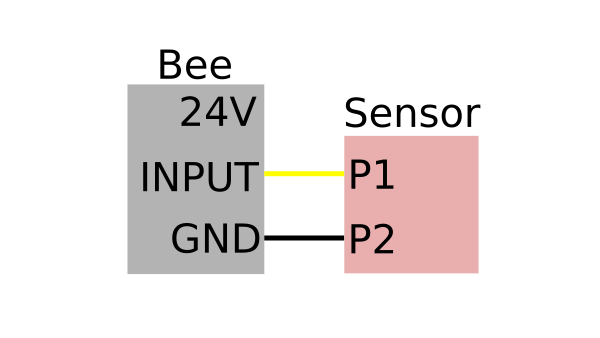
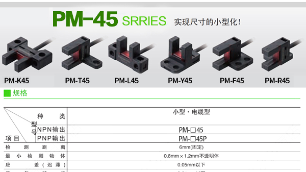
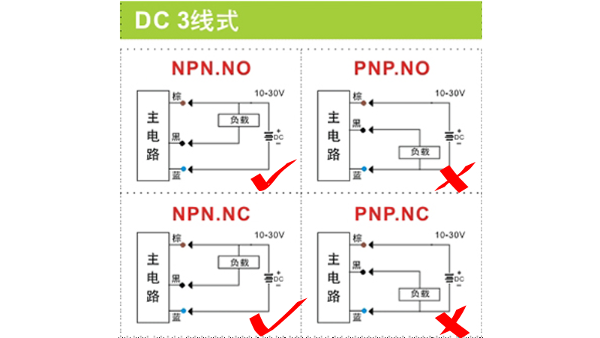

# DBD-Bee2

⭐ 欢迎使用Bee2步进电机驱动器 - DBD团队最新研发的高性能闭环步进电机驱动解决方案

## 目录

- [简介](#简介)
- [产品特性](#产品特性)
  - [技术参数](#技术参数)
  - [硬件接口](#硬件接口)
- [产品展示](#产品展示)
  - [外观设计](#外观设计)
  - [机械尺寸](#机械尺寸)
- [使用指南](#使用指南)
  - [调试软件](#调试软件)
  - [运行模式](#运行模式)
- [开发者资源](#开发者资源)
  - [Python SDK](#python-sdk)
  - [通信协议](#通信协议)
- [关于我们](#关于我们)

### 简介

---

- Bee2是DBD团队最新开发的一款小型步进电机驱动器,
- 采用大功率低发热独立MOS驱动
- 采用隔离通信
- 支持IO输入和IO输出接口
- 支持正负限位传感器接口，极大程度提高了系统的安全性。
- 支持增量式差分编码器接口，采用FOC控制，不丢步，高转速，低功耗和低发热。
- 采用大号尺寸的接插件，使得施工接线和维修变得更加方便。
- 虽然尺寸增加了一倍，达到50mm x 60mm x 9mm, 整体性能的提升却远不止一倍。

---

### 技术参数

---

|  |  |
| --- | --- |
| 重量 | 32g |
| 电机 | 4线2相闭环步进电机 |
| 细分 | 256 |
| 工作电压 | DC12V/24V |
| 最大持续输出电流 | 3A |
| PWM频率 | 20KHz |
| 输入IO | 1路(内部10K电阻上拉) |
| 输出IO | 1路 (开漏输出500mA) |
| 限位IO | 2路(内部10K电阻上拉) |
| RS485总线 | 默认250Kbps/500Kbps |
| 编码器类型 | 差分ABZ增量编码器 |
| 编码器分辨率 | 1000线(4倍频对应一圈4000脉冲信号) |
| 运行温度 | -10 to +60摄氏度 |

---

### 外观设计

---

---
### 硬件接口
- 电源：电源接口采用2个XH2.54-2P端子，可以并联使用增加供电电流，也可以串联使用，达到减少接线的目的
- 通信：通信接口采用2个XH2.54-4P端子，方便串联
- 电机：电机接口采用1个XH2.54-4P端子
- 限位：正负限位采用1个PHB2.0-3X2P端子
- IO：IO输入和IO输出采用1个PHB2.0-3X2P端子
- 编码器：编码器采用1个PB2.0-4X2P端子
---

### 机械尺寸

裸板尺寸

带外壳尺寸

---

### 接口布局

---

---

### IO输入接口,IO输出接口和限位传感器接口

---

传感器接口采用PHB2.0-3X2P接插件,
上排部分为IO输出接口,用来控制继电器和电磁刹车等.三个信号分别为GND,OUTPUT,24V,
下排部分三个信号分别为GND,INPUT,24V.其中24V为电源的供电电压,即当使用12V作为供电电压时,
向传感器提供12V的电压.INPUT信号为内部10K电阻上拉.下面介绍集中常用的回零传感器接法及注意事项.

#### 两脚触碰开关

#### 三脚触碰开关

#### 光电传感器

#### 霍尔传感器

#### PNP

---

### 调试软件

---

#### DBD TunerV6 for Windows

#### 驱动下载链接

[USB串口驱动(Windowns)](downloads/CH341SER.EXE)  
[USB串口驱动(Linux)](downloads/CH341SER_LINUX.ZIP)

---

#### 调试软件功能介绍

---

-----------------------这里放一个软件截图 带标注的---------------

---

### 运行模式

---

|  |  |
| --- | --- |
| 位置模式 | 位置模式,全称平滑位置模式.通常称为点位运动.根据设定的目标位置,目标速度以及加速时间 自行规划位置时间曲线并开始运动.  位置模式常用API及参数：    速度－时间曲线：    API使用流程示意图： |
| 速度模式 | 速度模式,全称平滑速度模式,根据设定读目标速度和加速时间自行规划速度时间曲线并开始运动. 该模式的控制对象是电机的运行速度,不关心电机的位置. |
| 回零模式 | 回零模式分为有感回零和无感回零两种回零模式。 有感回零即有传感器的回零模式， 进入回零模式后,根据设定的回零方向和目标速度开始运动,直到限位传感器触发,达到设置回零电平参数后停止运行, 并且自动将运行模式恢复为进入回零模式前的运行模式.注意限位传感器有正限位和负限位之分, 当回零方向为正方向时,只有正限位传感器有效,负限位传感器不生效.当回零方向为负方向时,只有负限位传感器生效,安装时要注意区分.    无感回零，即无外部传感器的回零模式，靠电机的编码器和驱动器的电流传感器检测电机的堵转判断是否到达机械零点。 通过设置回零触发条件进入有感或者无感回零模式。 |
| 插补模式 | 插补模式全称同步位置插补模式,用于实现8轴/32轴/256轴电机的同步插补运动.该模式通常用于3D打印机,写字机,画图机,雕刻机, 点胶机等需要多轴联动,并且执行连续轨迹的设备.USB485可以实现8轴电机的同步插补运动功能。如有需要32轴和256轴的同步插补运动控制器请联系客服。 |
| 急停模式 | 紧急停止模式适用于发生紧急情况下需要电机紧急停止的情况. 在以上任意运行模式运行期间都可以切换到急停模式,进入急停模式后, 将按照预设的急停减速系数，进行减速运动直至速度为0，完成急停动作后会自动恢复为平滑位置模式. 有两种方式可以进入急停模式:可以通过设置运行模式(参数索引0x03)为急停模式(参数值0x3d)直接进入急停模式. 也可以通过设置使能选项,传感器限位有效,当限位传感器触发时,将直接进入急停模式,停止后,自动恢复为位置模式. |

---

### 开发者资源

---

[Python SDK下载](downloads/Bee2-SDK.zip)
  
---

##### Python SDK接口说明

SDK接口分为4类,参数设置set类,参数获取get类,等待信号wait类,功能操作类,下面将做详细介绍.

|  |  |
| --- | --- |
| setPowerOn(id) | 设置对应id号的状态为使能,使能后电机开始受驱动器控制.使能后状态指示灯由快速闪烁变为慢速闪烁. |
| setPowerOff(id) | 设置对应id号的状态为失能,失能后电机不再受驱动器控制.失能后状态指示灯由慢速闪烁变为快速闪烁. |
| setTargetVelocity(id, value) | 设置目标速度.数值范围通常位1-300,单位pulse/ms近似等于RPM. |
| setTargetPosition(id, value) | 设置目标位置.Ant控制1.8度步进电机时,51200脉冲当量对应一圈. |
| setVelocityMode(id) | 设置运行模式为平滑速度模式,详细内容参考[运行模式](#operationmode) |
| setPositionMode(id) | 设置运行模式为平滑位置模式,详细内容参考[运行模式](#operationmode) |
| setHomingMode(id) | 设置运行模式为回零模式,详细内容参考[运行模式](#operationmode) |
| setHomingDirection(id, value) | 设置回零方向.取值为1或者-1. |
| setHomingLevel(id, value) | 设置回零电平.取值为1或者0. |
| setRunningCurrent(id, value) | 设置运行电流.取值范围100-1500,单位mA,通常300-800比较合理. |
| setKeepingCurrent(id, value) | 设置保持电流.取值范围100-1500,单位mA,通常300-800比较合理. |
| setAccTime(id, value) | 设置加速时间.在位置模式下或者速度模式下的加减速过程的时间,单位ms.通常100-2000比较合理. |
| setOutputIO(id, value) | 设置IO输出.取值0或者1. |
| getInputIO(id) | 获取输入IO的状态.返回值为0或者1. |
| getActualVelocity(id) | 获取当前的实际运行速度. |
| getActualPosition(id) | 获取当前的实际位置. |
| getTargetVelocity(id) | 获取目标速度. |
| getTargetPosition(id) | 获取目标位置. |
| getRunningCurrent(id) | 获取运行电流. |
| getKeepingCurrent(id) | 获取保持电流. |
| getAccTime(id) | 获取加速时间. |
| getHomingDirection(id) | 获取回零方向. |
| getHomingLevel(id) | 获取回零电平. |
| waitHomingDone(id) | 等待回零完成. |
| waitTargetPositionReached(id) | 等待目标位置到达. |
| getDeviceID(id) | 获取设备ID. |
| scanDevices() | 扫描在线设备. |
| saveParameters(id) | 保存参数. |
| changeID(id, value) | 修改ID.ID范围0-31. |

---

##### 如何使用Python SDK

###### 准备工作

1.安装pyserial.用户可以通过pycharm的库管理下载添加, 或者通过命令行添加, 有问题请联系我们或者自行搜索解决.  
2.桌面开发环境推荐使用PyCharm进行程序编写.  
3.终端开发环境,sudo python3 -m pip install pyserial  
4.获取串口权限.Linux下的设备使用都需要使用sudo或root用户才能打开，为了能让普通用户也能使用串口，可以增加udev规则来实现，具体方法如下： sudo vim
/etc/udev/rules.d/70-ttyusb.rules 增加如下内容： KERNEL=="ttyUSB[0-9]\*",MODE="0666"
保存，重新插入USB转串口，普通用户就能搞定了.  
5.下载[Python SDK](#sdk).并拷贝到用户运行目录.

###### 扫描在线设备

###### 使能/失能

###### 平滑位置模式的例子

###### 回零模式的例子

###### 平滑速度模式的例子

###### 急停模式的例子

###### 插补模式的例子

---

#### 通信协议

Bee2采用RS485总线接口进行通讯, 通信速率默认250kbps.  
注意如果使用USB485(DBD专用),内置加速MCU,USB串口侧的波特率为2Mbps.  
普通的USB转RS485模块,可以直接设置波特率为250kbps,但是不支持多轴同步插补模式.  
  

##### 通信模型

通信模型采用常规的主从模式,即所有的Bee2都是从站,用户的控制器或者USB调试器为主站.总线上主站发送指令后,
所有从站接收并判断是否是自己的指令.如果是自己的指令,则立刻进行回复,如果不是自己的消息,则保持沉默.  
  

##### 通信参数

波特率:默认250Kbps  
数据位:8位  
停止位:1位  
校验位:无  
  

##### 通信指令格式

一条指令由8个字节组成:   
功能码(1-byte),索引码(1-byte),主ID(1-byte),子ID(1-byte),数据值(4-byte)  
其中:  
  
功能码:  
0x00 - 读参数指令  
0x01 - 写参数指令  
0x02 - 读成功  
0x03 - 写成功  
0x04 - 操作指令  
0x05 - 操作成功  
  
索引码:  
0x00 - 主板类型(只读)  
0x01 - 设备ID(读/写)(可以读取该参数,通过遍历ID号,来判断该ID是否在线.写该参数可以用来改变设备ID,但需要随后发送新的ID号保存参数的指令,才能永久修改)  
0x02 - 使能(读/写)(1-使能,电机控制开始.0-失能,电机不受控制,可用于手动模式)  
0x03 - 运行模式(读/写)(21-速度模式,31-位置模式,34-同步插补模式,40-回零模式,61-急停模式)  
0x04 - 状态信息(只读)(具体参考状态字描述)  
0x05 - 预留.  
0x06 - 预留.  
0x07 - 目标速度(读/写)(步进电机的最大运行速度)  
0x08 - 实际速度(只读)(步进电机的实际运行速度)  
0x09 - 目标位置(读/写)(步进电机的目标运行位置)  
0x0A - 实际位置(读/写)(步进电机的实际运行位置)  
0x0B - 加速时间(读/写)(步进电机的加减速过程的时间,单位ms,通常不小于200ms)  
0x0C - 插补目标位置(读/写)(插补模式下的目标位置指令)  
0x0D - 预留  
0x0E - 回零方向(读/写)(1-正方向,-1负方向)  
0x0F - 回零电平(读/写)(1-高电平触发,0-低电平触发)  
0x10 - 预留  
0x11 - 运行电流(读/写)(步进电机运行时的电流)  
0x12 - 保持电流(读/写)(步进电机保持时的电流)  
0x13 - 编码器偏移  
0x14 - 编码器极性  
0x15 - 编码器数值  
0x16 - 输入IO回零传感器的状态(只读)(0-低电平,1-高电平)  
0x17 - 输出IO(读/写)(0-低电平,1-高电平)  
0x18 - 预留  
0x19 - 预留  
0x1A - 预留  
0x1B - 预留  
0x1C - 功率限制系数  
0x1D - 预留  
0x1E - 预留  
0x1F - 预留  
0x20 - KPP系数  
0x21 - 预留  
0x22 - KVF系数  
0x23 - KFF系数  
0x24 - 软件限位正限位位置  
0x25 - 软件限位负限位位置  
0x27 - 紧急停止的减速度系数  
  
主ID:  
编码范围:0-31  
  
子ID:(为了兼容Elephant 8in1控制器和其他多合一控制器,Bee控制器默认该参数为0即可)  
编码范围:0-7  
  
数据:  
数据类型:int整数(32位)  
低位在前,例如10进制数据:100 表示为 0x64 0x00 0x00 0x00  
  

##### 控制字ControlWord参数说明

BIT0(0x01) 1-On/0-Off(电机使能)  
BIT1(0x02) 预留  
BIT2(0x04) 预留  
BIT3(0x08) 预留  
BIT4(0x10) 1-开环模式/0-闭环模式  
BIT5(0X20) 1-电机带电磁刹车/0-电机不带电磁刹车(电磁刹车可以直接接到IO接口的IO输出,一端接24V,一端接OUT)  
BIT6(0x40) 1-传感器限位无效/0-传感器限位有效  
  

##### 状态字StatusWord参数说明

BIT0(0x01) 1-On/0-Off(使能)  
BIT1(0x02) 1-已回零/0-未回零  
BIT2(0x04) 1-目标位置已到达/0-目标位置未到达  
BIT3(0x08) 1/0-回零传感器IO状态  
BIT4(0x10) 1/0-正限位传感器IO状态  
BIT5(0x20) 1/0-负限位传感器IO状态  
BIT6(0x40) 1-急停状态生效/0-急停状态未生效  
BIT7(0x80) 运行模式状态值BIT0  
BIT8(0x100) 运行模式状态值BIT1  
BIT9(0x200) 运行模式状态值BIT2  
BIT10(0X400) 报警状态位置超差  
BIT11(0X800) 报警状态编码器未连接  
BIT12(0X1000) 报警状态过流保护  
  

###### 运行模式状态值说明

0 - 平滑位置模式  
1 - 平滑速度模式  
2 - 传感器回零模式  
3 - 无传感器回零模式  
4 - 快速急停模式  
5 - 平滑急停模式  
6 - 同步插补模式  
  

##### 如何使用位操作, 设置控制字或者读取状态字

首先理解二进制和十六进制的转换:  
如(4bit二进制转换为十六进制,32bit二进制同样的道理):  
BIT0, 0b0001->0x1, 0X1<<0  
BIT1, 0b0010->0x2, 0X1<<1  
BIT2, 0b0100->0x4, 0X1<<2  
BIT3, 0b1000->0x8, 0X1<<3  
例子01,设置控制字,BIT4=1,开换模式: value |= (0x1<<4)  
例子02,设置控制字,BIT4=0,闭环模式: value &=~ (0x1<<4)  
例子03,设置控制字,BIT5=1,带刹车: value |= (0x1<<5)  
例子04,读取状态字,BIT11,编码器连接状态值:  
if( (value&(0x1<<11)) == 0)  
{  
//BIT11 = 0  
}  
else  
{  
//BIT11 = 1  
}  

##### 指令例子(16进制)

1.读取ID=1的设备类型:  
0x00 0x00 0x01 0x00 0x00 0x00 0x00 0x00  
返回值:  
0x02 0x00 0x01 0x00 0x11 0x00 0x00 0x00  
  
2.使能ID=1的设备:  
0x01 0x02 0x01 0x00 0x01 0x00 0x00 0x00  
  
3.失能ID=1的设备:  
0x01 0x02 0x01 0x00 0x00 0x00 0x00 0x00  
  

---

## 相关视频

---

## About DBD

DBD is a startup manufacturer of innovative matrix motion technologies, and as a manufacturer and
developer
of motor drives, controllers, and systems, DBD is designing its technology with emphasis on
performance,
efficiency, reliability, safety and simplicity.

* [Twitter](#)
* [Facebook](#)
* [Instagram](#)
* [Email](#)

© DB Dynamics